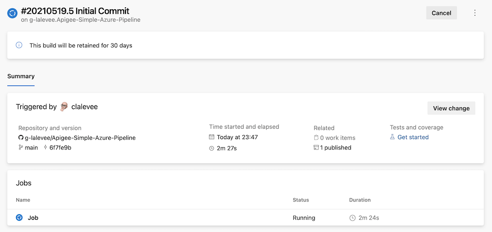
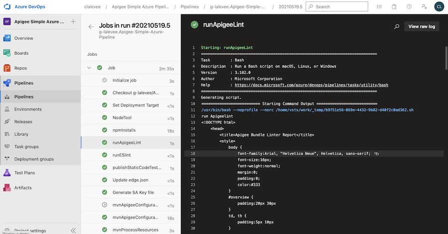
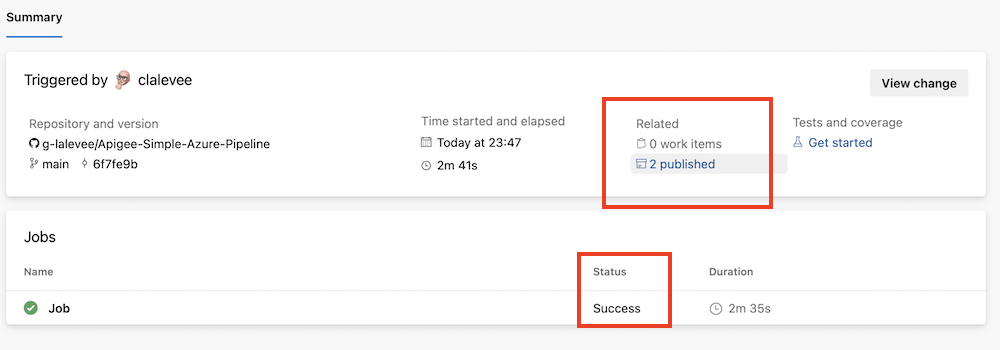
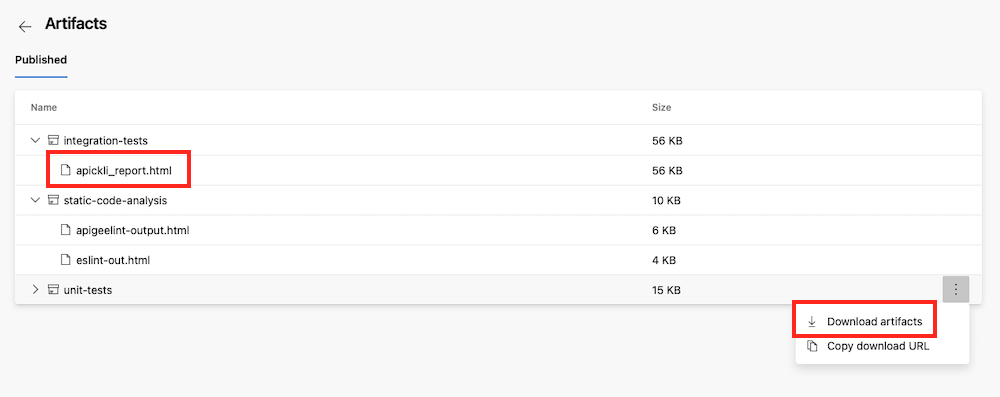
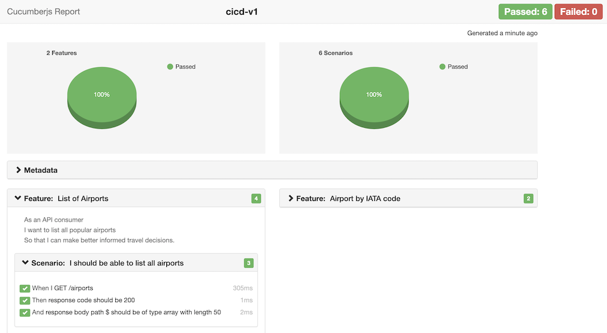

# Apigee CI/CD using GitHub, Azure Pipeline and Maven 

[](https://pypi.python.org/pypi/ansicolortags/) 

**This is not an official Google product.**<BR>This implementation is not an official Google product, nor is it part of an official Google product. Support is available on a best-effort basis via GitHub.

***

## Goal

Simple implementation of a CI/CD pipeline for Apigee using
[Azure Pipeline](https://docs.microsoft.com/en-us/azure/devops/pipelines/get-started/what-is-azure-pipelines?view=azure-devops) and the [Apigee Deploy Maven Plugin](https://github.com/apigee/apigee-deploy-maven-plugin).

The CICD pipeline includes:

- Git branch dependent Apigee environment selection and proxy naming to allow
  deployment of feature branches as separate proxies in the same environment
- Static Apigee Proxy code analysis using [apigeelint](https://github.com/apigee/apigeelint)
- Static JS code analysis using [eslint](https://eslint.org/)
- Unit JS testing using [mocha](https://mochajs.org/)
- Integration testing of the deployed proxy using
  [apickli](https://github.com/apickli/apickli)
- Packaging and deployment of an Apigee configuration using
  [Apigee Config Maven Plugin](https://github.com/apigee/apigee-config-maven-plugin)
- Packaging and deployment of the API proxy bundle using
  [Apigee Deploy Maven Plugin](https://github.com/apigee/apigee-deploy-maven-plugin)

**This CICD pipeline allows deployment to both Apigee Edge and Apigee X/hybrid. A variable (API_VERSION) in azure-pipelines.yml file defines the deployment target.**


### API Proxy and Apigee configuration

The folder [./apiproxy](./apiproxy) includes a simple API proxy bundle, a simple Apigee configuration file [./EdgeConfig/edge.json](./EdgeConfig/edge.json) as well as the following resources:

- [azure-pipelines File](./azure-pipelines.yml) to define an Azure DevOps
  multi-branch pipeline.
- [test Folder](./test) to hold the unit and integration
  tests.


## Target Audience

- Operations
- API Engineers
- Security

## Limitations & Requirements

- The authentication to the Apigee Edge management API is done using OAuth2. If
  you require MFA, please see the [documentation](https://github.com/apigee/apigee-deploy-maven-plugin#oauth-and-two-factor-authentication)
  for the Maven deploy plugin for how to configure MFA.
- The authentication to the Apigee X / Apigee hybrid management API is done using a GCP Service Account. See [CI/CD Configuration Instructions](#CI/CD-Configuration-Instructions).

## Prerequisites

### Azure DevOps

The setup described in this reference implementation is based on Azure DevOps pipeline. So, you must have a Azure account you will use to create a pipeline linked to this GitHub repository. See [Azure DevOps Services](https://azure.microsoft.com/en-us/services/devops/).


## CI/CD Configuration Instructions

### Apigee hybrid / Apigee X only

Apigee hybrid / Apigee X deployement requires a GCP Service Account with the following roles (or a custom role with all required permissions):

- Apigee API Admin
- Apigee Environment Admin

To create it in your Apigee organization's GCP project, use following gcloud commands (or GCP Web UI):

```sh
SA_NAME=<your-new-service-account-name>

gcloud iam service-accounts create $SA_NAME --display-name="Azure-ci Service Account"

PROJECT_ID=$(gcloud config get-value project)
AZURE=$SA_NAME@$PROJECT_ID.iam.gserviceaccount.com

gcloud projects add-iam-policy-binding "$PROJECT_ID" \
  --member="serviceAccount:$AZURE_SA" \
  --role="roles/apigee.environmentAdmin"

gcloud projects add-iam-policy-binding "$PROJECT_ID" \
  --member="serviceAccount:$AZURE_SA" \
  --role="roles/apigee.apiAdmin"

gcloud iam service-accounts keys create $SA_NAME-key.json --iam-account=$AZURE_SA --key-file-type=json 

```

Copy `<your-new-service-account-name>-key.json` file content to clipboard. 

Note: you can update and run [generate-SA.sh](./generate-SA.sh) file to create your GCP service account.


### Initialize a GitHub Repository

To clone the `Apigee-Simple-Azure-Pipeline` in your GitHub repository `github.com/my-user/my-api-proxy-repo`, follow these
steps:

```bash
git clone git@github.com:g-lalevee/Apigee-Simple-Azure-Pipeline.git
cd Apigee-Simple-Azure-Pipeline
git init
git remote add origin git@github.com:my-user/my-api-proxy.git
git checkout -b feature/cicd-pipeline
git add .
git commit -m "initial commit"
git push -u origin feature/cicd-pipeline
```
 

### Azure Pipeline Configuration 

1.  Create a pipeline<BR>
In your [Azure DevOps account](https://dev.azure.com), create a new project. From the **Pipelines** menu, select **Pipeline** and select **GitHub**, then select your cloned repository as source repository. Terminate your pipeline configuration and save it.<BR>
Next step will be to add Apigee credentials to your pipeline. 


> If the target is Apigee Edge...

2.  Add pipeline variables `APIGEE_USER` and `APIGEE_PASSWORD`, to store your Apigee User ID and password:
- Go to **Pipelines** menu, edit the pipeline, then **Variables** button to add variables.
- Click the **+** button.<BR>In the New variable modal, fill in the details:
  - Name: APIGEE_USER
  - Value: your Apigee user ID 
  - Click the **OK** button
- Click again the **+** button.<BR>In the New variable modal, fill in the details:
  - Name: APIGEE_PASSWORD
  - Value: your Apigee user ID password
  - Keep this value secret: checked
  - Click the **OK** button

> If the target is Apigee X / Apigee hybrid

2.  Add pipeline variable `GCP_SERVICE_ACCOUNT`, to store your GCP Service Account json key:
- Go to **Pipelines** menu, edit the pipeline, then **Variables** button to add variables.
- Click the **+** button.<BR>In the New variable modal, fill in the details:
  - Key: GCP_SERVICE_ACCCOUNT
  - Value: paste clipboard (containing GCP SA JSON key copied before)
  - Keep this value secret: checked
  - Click the **OK** button

3.  (option) Force triggered pipeline execution<BR>If you don't want to manage build trigger from azure-pipelines.yml (see [Azure DevOps Continuous integration triggers](https://docs.microsoft.com/en-us/azure/devops/pipelines/repos/github?view=azure-devops&tabs=yaml#ci-triggers)), you can force it using Pipeline Settings:
- Go to **Pipelines** menu, edit the pipeline, then **More options** button and select **Triggers**.
- In **Continuous Integration** section, check **Override the YAML continuous integration trigger from here** and **Enable continuous integration**


## Run the pipeline

Using your favorite IDE...
1.  Update the **azure-pipelines.yml** file<BR>
In global **Variables** section, change **DEFAULT_APIGEE_ORG**, **DEFAULT_APIGEE_ENV**, **TEST_HOST** values by your target Apigee organization, environment and Apigee environment hostname.<BR>
Update **API_VERSION** variable to define Apigee target: `googleapi` = Apigee X / Apigee hybrid, `apigeeapi` = Apigee Edge
2.  Read carefully the **Set Deployment Target** step (bash) to check if the multibranch rules match your Git and Apigee environment naming and configuration.
3. Save
4. Commit, Push.. et voila!


Use the Azure DeveOps UI to monitor your pipeline execution and read test reports:

- Go to **Pipelines** menu, select the pipeline, and select the **Runs** section. <BR> Click on the running build you want to monitor.


- The summary page displays builds summary and status. Click on running **Job**



- You can see all steps running, and their logs



- When the build is over, click on the top-left arrow. Then, you see execution status and link to artifacts generated ("2 published")



- Click on artifact link, to access artifact folders and list



- Click on artifact, to download it. Open file with your browser. For example, Apickli report:



